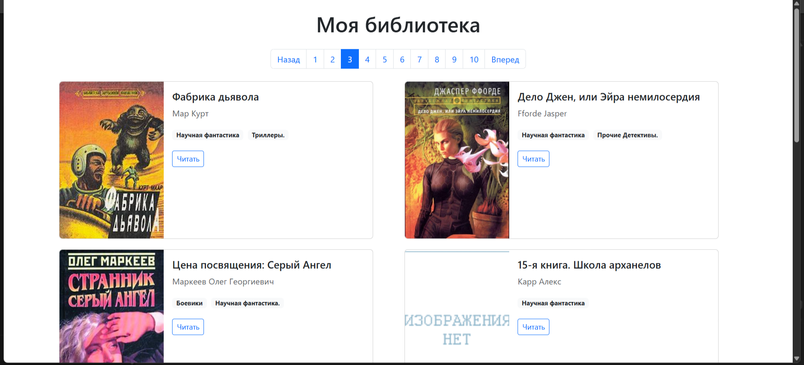

# Онлайн библиотека

Проект — простой сайт для просмотра книг с пагинацией и указания жанра.

---

## Ссылка на опубликованный сайт

[Моя библиотека на GitHub Pages](https://lek29.github.io/OnlineLibrary/page3.html)

---

## Скриншот сайта



---
## О проекте

- Книги подгружаются из файла `meta_data.json`.
- Все страницы с книгами генерируются в корневую папку (`index.html`, `page2.html`, …).
- Используется шаблонизатор Jinja2 для генерации HTML.
- Пагинация с кнопками "Назад" и "Вперёд", текущая страница подсвечена.
- Жанры книг отображаются и выводятся в виде тегов.
- Статические файлы (CSS, изображения) находятся в папке `static/`.

---

## Как запустить локально

1. Клонируйте репозиторий:
   ```bash
   git clone https://github.com/Lek29/OnlineLibrary
   cd OnlineLibrary
   ```
   
2. Установите зависимости (рекомендуется использовать виртуальное окружение):

   ```bash
   pip install -r requirements.txt
   ```

3. Сгенерируйте HTML-страницы и запустите локальный сервер с автообновлением:

   ```bash
   python render_website.py
   ```
4. Откройте сайт в браузере:
  http://127.0.0.1:5500


